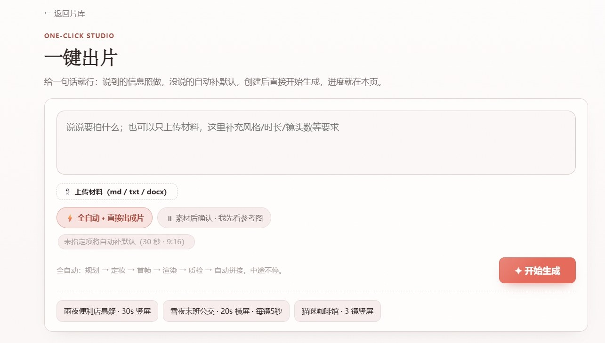
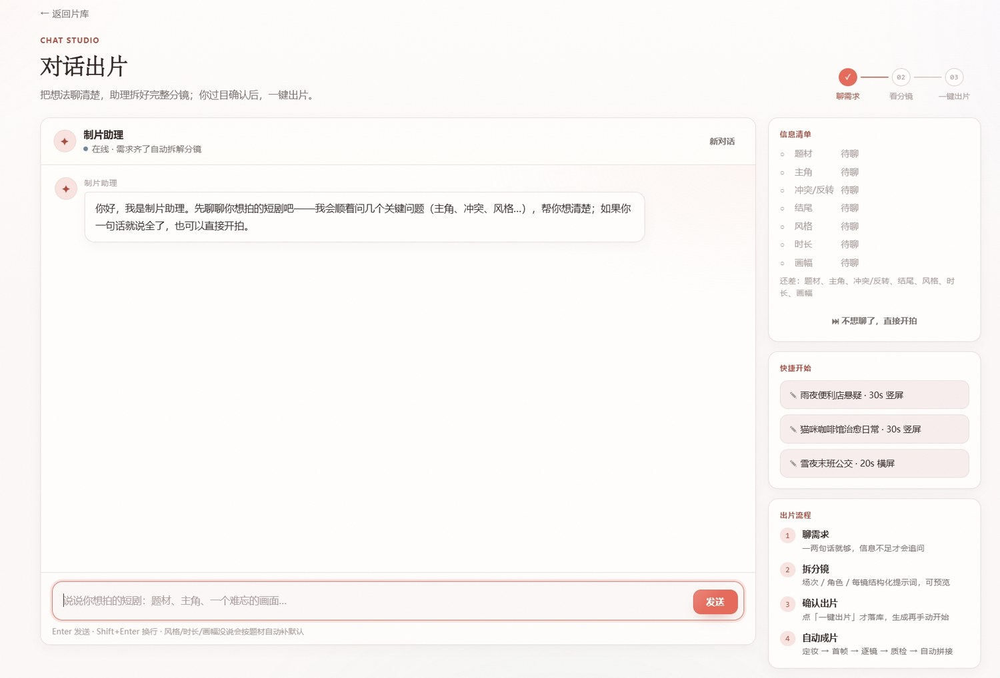
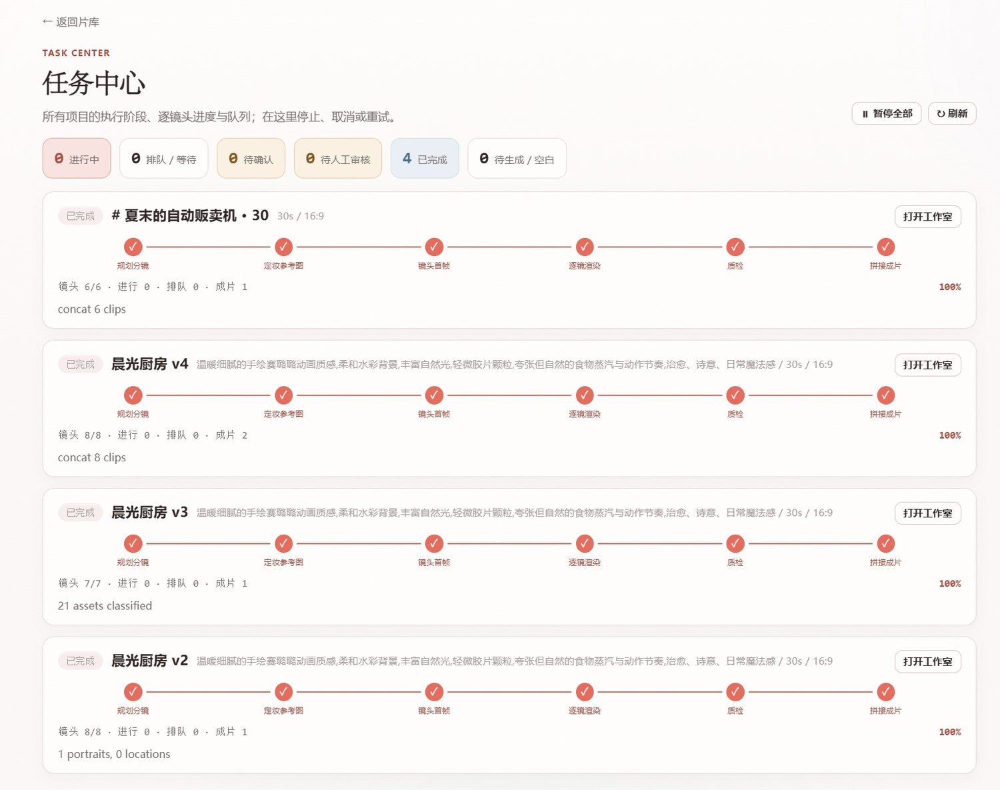
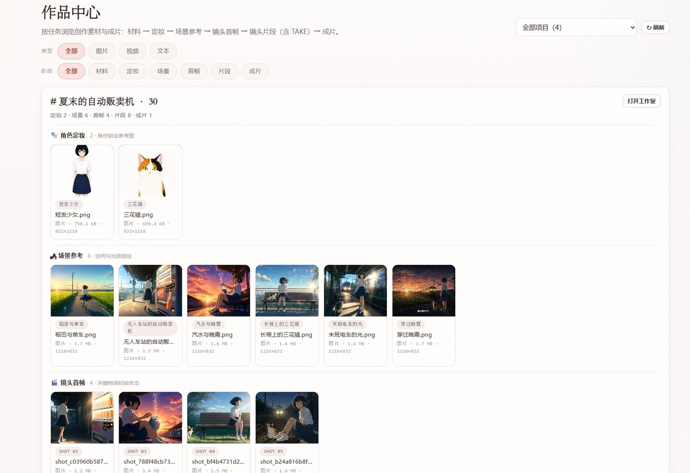

<a id="sec-project"></a>

# 项目说明：镜界 Scenery · 短视频工厂 Agent

## 目录

- [项目说明](#sec-project)
- [作品展示视频](#sec-showcase)
- [Fusion Xpark GB10 Linux 部署说明](#sec-deployment)
- [技术栈说明](#sec-tech-stack)
- [Agent Skills](#sec-skills)

## 1. 一句话介绍

镜界 Scenery（短视频工厂 Agent）是一套运行在 NVIDIA Fusion Xpark GB10 Linux 上的本地短视频生产系统：它将 StepFun 主 Agent、多智能体协同、结构化分镜、素材资产管理、MiniMax-H3 视频生成、Laya / OpenJev 本地决策、质检修复和成片导出整合为一条可观察、可恢复、可追溯的生产流水线。

<a id="sec-showcase"></a>

## 作品展示视频

[](docs/assets/learn_video.mp4)

▶ **点击上方封面或下方链接播放完整演示**：[learn_video.mp4 · 作品展示视频](docs/assets/learn_video.mp4)

> 演示视频随仓库提交在 `docs/assets/learn_video.mp4`，点击后由 GitHub 内置播放器播放。GitHub 会过滤 README 中手写的 `<video>` 标签，因此这里通过封面 + 链接方式提供播放入口。

## 2. 行业痛点

短视频和内容团队在使用生成式 AI 时，真正困难的不是"生成一次"，而是"稳定生产"。常见痛点包括：

1. **素材浪费**：团队已有剧本、角色图、场景图、视频片段和配音，但多数工具只支持从零生成，已有资产不能进入统一生产链路。
2. **角色与场景漂移**：多镜头视频中角色外观、服装、道具和空间关系容易不一致，导致无法组成完整短剧。
3. **失败不可解释**：生成失败后只有"重新生成"按钮，没有失败标签、证据片段和修复策略。
4. **任务不可恢复**：长任务被中断后，无法区分网络重发、主动重试和新任务，容易重复消耗算力。
5. **模型绑定过强**：很多 Agent 应用把文本模型写死，无法根据赛事、成本、隐私和本地算力条件切换主模型。
6. **Demo 与生产脱节**：Demo 只展示一次成功，生产系统需要状态机、事件流、审计、测试和部署文档。

本项目针对这些痛点，把 Fusion Xpark GB10 本地算力组织成一套"可持续交付"的短视频工厂，而不是单点生成脚本。

## 3. 解决方案概述

围绕"如何让短视频从单次生成升级为持续生产"这一核心问题，系统由四条主轴构建：

- **一、结构化契约**：把 LLM 创作约束进剧本 / 角色 / 场景 / 道具 / 分镜 / 剪辑 六层 schema，时长、画幅、密度、台词格式都由代码钳制；漂移从"玄学"变成"可定位的契约违例"。
- **二、流水线化**：所有 Agent、渲染、质检、修复、合成必须经统一状态机 + SSE 事件流；每个 Run 都记录工作流哈希、模型配置、素材版本、seed 与输出文件，事件可回放、状态可恢复。
- **三、多 Agent 协同**：内置制片助理 → 编剧 → 选角 → 导演 → 提示词优化 → 审核 → 修复 七类 Agent，共享 ShotSpec / ScoreReport / RepairPlan，谁都不许绕过状态机；多 Agent 的价值不是"看起来像团队"，而是"每步可验证、可替换、可审计"。
- **四、本地极致优化**：在 Fusion Xpark GB10 上以 FP8 UNet + BF16 VAE / 文本编码器 运行 MiniMax-H3 渲染；009jev Native SLA + Laya / OpenJev 决策引擎逐层选 keep rate；端到端 5 秒 4 step 热缓存视频 **530.2 秒 → 340.1 秒（-35.9%）**，每条合格视频的生产成本直接砍掉三分之一。

质量与修复闭环：审核 Agent 用 ScoreReport 记录证据（文件 / 时长 / 音轨 / 抽帧 / 动作 / 水印 / 多余人物），用 RepairPlan 驱动定向修复；超过预算后自动转人工审核，关键项失败不可被总分抵消。

> **一句话：本系统的核心不是"会画"，而是"敢交付"。**

## 4. 作品特点与核心亮点

### 4.1 拒绝 AI 抽卡：让短视频生产像流水线一样可控

项目面向最终使用者（无需懂提示词工程、镜头语言、ComfyUI）的核心定位：

- **拒绝抽卡，可解释可修复**：每条视频都带结构化分镜、显式验收项、质检证据和修复计划，失败原因不再是「再点一次试试」的概率博弈，而是 ScoreReport → RepairPlan 的定向重渲染。
- **完整 Agent 流水线**：内置制片助理 → 编剧 → 选角 → 导演 → 提示词优化 → 审核 → 修复 七类 Agent 协同，覆盖「写剧本到导出成片」全过程；详见 4.2。
- **内置导演 Skill**：仓库自带 `short-drama-script` skill 把导演经验（六层契约、节奏、密度、约束清单、写作侧预防对照表）固化进规划链路，LLM 一次写出来就是合格分镜；详见 4.5。
- **审核 Agent 验收闭环**：每镜渲染完自动跑文件检查 + 抽帧评分 + 验收项命中，输出 ScoreReport；失败证据直接驱动 RepairPlan 重渲染，不是盲重抽。
- **小白也能用**：在工作台 `#/chat` 用一句话或一段对话 → 自动产出结构化分镜 → 一键出片；不必懂 ComfyUI、不必懂 H3 提示词。
- **两类内容形态开箱即用**：短剧 / 广告用 `short-drama-script`，文档 / 图片学习视频用 `learning-video`，都自带脚本、质检和拼接工具。

### 4.2 StepFun 主 Agent + 多智能体协同

项目将主 Agent 模型抽象为可插拔文本模型层。赛事推荐配置使用 StepFun 阶跃星辰作为主 Agent，通过 OpenAI-compatible endpoint 接入；仓库不硬编码密钥、endpoint 或模型名。主 Agent 负责高层创作和修复推理，底层由代码契约、状态机和质检规则约束。

多 Agent 分工包括：

- 制片助理：把自然语言需求整理成 brief、风格、时长和画幅。
- 编剧 Agent：生成场景与剧情摘要。
- 选角 Agent：登记角色、地点和外观一致性描述。
- 导演 Agent：拆分镜头，生成 ShotSpec。
- 提示词优化 Agent：把 ShotSpec 转成 H3 可执行提示词。
- 审核 Agent：结合文件检查、抽帧和验收规则生成 ScoreReport。
- 修复 Agent：根据失败证据生成 RepairPlan，并在预算内重新执行。

### 4.3 结构化分镜让生成可控

短视频生成最容易失控的地方不是模型不会画，而是镜头目标不清楚。项目用六层契约约束剧本、角色、场景、道具、分镜和剪辑：角色描述全片一致，关键道具登记数量和起止状态，每镜只有一个主动作，台词进入统一语法，否定约束使用英文，验收项和禁止项显式写出。这样可以把"看起来合理"的文本变成"可以渲染、可以验收"的生产指令。

### 4.4 本地模型优化服务于生产指标

模型优化不是为了展示单点技巧，而是为了减少每条合格视频的总耗时和无效重试。项目在 Fusion Xpark GB10 Linux 上采用 009jev Native SLA 路径，从首步开始由本地决策引擎选择逐层 keep rate；Laya 默认在本地运行，OpenJev 作为实验路径接入同一契约。当前实测中，5 秒 4 step 热缓存视频的基线耗时为 530.2 秒，Laya 路径为 340.1 秒，降低约 35.9%；OpenJev 路径为 400.1 秒，降低约 24.5%。

### 4.5 Agent Skills 将经验固化为可复用能力

仓库内置三个 skill：

- `deploy-scenery-factory`：让任意 Agent 从零把本项目部署成可用的短剧 Agent 工厂，覆盖环境自检、依赖安装、`.env` 配置、服务启动与健康验收。
- `learning-video`：把文档或图片集转成 1080P 学习视频，覆盖素材提取、旁白、动效脚本、批量生成、抽帧质检、拼接和去水印。
- `short-drama-script`：把短剧剧本阶段的结构化提示词规范沉淀为可复用约束，覆盖剧本、角色、场景、道具、分镜和剪辑六层契约。

### 4.6 端到端界面（实拍）

**① 首页 · 最近创作与工作状态**


侧栏分为创作（首页 / 一键出片 / 对话出片）、项目（创建项目 / 我的项目）与资产（任务中心 / 作品中心）；Hero 区是「开始创作」入口，下方并列展示最近创作的项目卡片（含分镜数、镜头数与封面），右下工作状态卡实时汇总正在执行 / 等待执行 / 已完成项目数。

**② 一键出片 · 一句话全自动**



输入一句话需求即可，也可上传 `md` / `txt` / `docx` 材料；可切换「全自动·直接出片」与「素材后确认·我先看参考图」两种节奏，题材 / 时长 / 画幅有默认值可微调。全自动路径依次完成 **规划 → 定妆 → 首帧 → 渲染 → 质检 → 自动拼接**，中途不停。

**③ 对话出片 · 制片助理信息清单**



对话式入口：左侧与「制片助理」多轮对话补全创作意图，右侧信息清单实时显示题材 / 主角 / 冲突反转 / 结局 / 风格 / 时长 / 画幅的收集进度（未聊到的项标记「待聊」）；顶部提供「快捷开始」模板，下方固定展示出片流程的四个阶段。

**④ 任务中心 · 六阶段流水线执行**



每个 Run 被拆成 **规划分镜 → 定妆 → 镜头首帧 → 逐镜渲染 → 质检 → 拼接成片** 六个可见阶段，顶部统计条汇总项目 / 镜头 / 成片等指标；失败项带失败标签与修复入口，任务可暂停、恢复、取消。

**⑤ 作品中心 · 素材资产（角色 / 场景 / 首帧）**



体现「导入优先、缺口生成」：素材入库即登记来源、哈希、版本与用途；角色定妆、场景参考、镜头首帧按类型归档，可直接复用的资产不必重复生成。

**⑥ 作品中心 · 镜头片段与成片**


逐镜保留历史片段并标记「已采用 TAKE」，每个片段都能回溯到输入、参数、seed、模型版本与质检证据；底部输出拼接完成的成片文件。

## 5. 技术实现方案

系统分为五层：

1. **Web 产品层**：`apps/web`（原生 HTML / CSS / JS，零构建）提供项目、素材、分镜、视频生成、任务监控、审核和成片界面。
2. **编排与决策层**：`apps/api`（`app.py`）提供 FastAPI 接口和 SSE 事件流；`domain` 保存状态机、数据契约和业务约束；Laya / OpenJev 决策通过 `comfyui-node/` 下的统一客户端接入。
3. **创作与资产层**：`agents/` 包含制片、编剧、选角、导演、提示词优化、审核、修复等角色；`ingestion/` 与 `adapters/asset_store` 负责素材上传、解析、绑定和版本管理。
4. **生成与质检层**：ComfyUI Adapter（`adapters/comfyui`）调用冻结的 MiniMax-H3 API 工作流；`quality/` 对视频进行文件检查、抽帧评估、密度分析和证据记录。
5. **交付与恢复层**：`workers/compose.py` 使用 FFmpeg 合成成片；command_id、attempt_id、事件游标和 SQLite 数据文件共同支持幂等、断点续跑和审计。



*架构总览（动图）：脉冲沿流水线依次点亮「素材导入 → 编剧拆解 → 结构化分镜 → H3 渲染 → 质检取证 → 失败修复 → 成片导出」，各阶段事件汇入下方事实来源，五层模块按同一节拍依次点亮。*

## 6. 架构设计思路

架构核心原则是"数据库与事件流是事实来源，Agent 是可替换的角色任务"。每个镜头有 ShotSpec，每次执行有 Run，每次质检有 ScoreReport，每次修复有 RepairPlan。Web 页面不直接操作模型，而是通过 API 与事件流观察和控制任务。这样可以避免多个 Agent 各自维护冲突上下文，也让暂停、恢复、取消和失败追溯有统一语义。

素材系统采用"导入优先、缺口生成"的策略。导入素材先进入资产系统，记录来源、哈希、版本、用途和绑定关系；可直接复用的视频片段经过标准化和质检后进入成片，不必重复生成。缺失的角色定妆图、场景图或首帧再由图像服务补齐。这个策略能显著降低 Fusion Xpark GB10 上的无效计算，并让最终成片更容易解释和审计。

## 7. 优化方案

项目在 Fusion Xpark GB10 Linux 上的优化重点不是盲目堆并发，而是减少重复加载、减少无效重试、控制显式资源占用。ComfyUI 启动参数使用 FP8 UNet、BF16 VAE 与文本编码器，并保留一定显存余量；Laya 决策默认走本地 GPU，支持批处理、紧凑状态和置信度兼容映射；OpenJev 使用 GGUF 与 `llama-server`，通过前缀缓存降低逐问决策开销。重型任务通过独占租约、心跳与 fencing token 避免重复占用和迟到结果写入。

生产层还做了三类优化：一是工作流模板冻结，避免运行时拼接不可维护的节点图；二是素材哈希、版本和输入快照，避免重复渲染；三是失败标签驱动的修复预算，超过预算后转入人工审核，而不是无限重试。最终交付以"被验收的镜头"为准，保证每个成片片段都能回溯到输入、参数、模型版本、质检证据和审核记录。

## 8. 行业落地价值

本项目适合短视频团队、教育内容团队、电商素材团队和本地私有化内容生产场景。它的价值不在于替代创作者，而在于把重复、可控、可验收的生产环节自动化：素材入库、镜头拆解、提示词组装、生成排队、质量检查、失败修复和成片导出。创作者仍然掌握创意、审核和最终审美判断，系统负责让生产过程更快、更稳、更可追溯。

## 9. 总结

短视频工厂 Agent 的核心竞争力是把 Fusion Xpark GB10 本地算力、StepFun 主 Agent、多智能体协同、MiniMax-H3 生成、Laya / OpenJev 决策优化和 Agent Skills 组织成一个完整生产系统。它既回应了"能不能生成"的问题，也回答了"能不能持续生产、能不能解释质量、能不能恢复失败、能不能落地到团队流程"的问题。

---

<a id="sec-deployment"></a>

# Fusion Xpark GB10 Linux 部署说明

部署目标：**NVIDIA Fusion Xpark GB10 + aarch64 Linux**。

## 1. 部署范围

- 真实主机：`localhost`
- SSH 用户：`wlf`；需要 root 操作时登录后提权。密码不写入仓库。
- 操作系统：aarch64 Linux
- 硬件平台：NVIDIA Fusion Xpark GB10（Grace-Blackwell，统一内存，sm_121）
- 容器运行：Docker + Docker Compose + NVIDIA Container Toolkit / CDI
- 核心服务：ComfyUI、Scenery-Factory FastAPI、StepFun 主 Agent provider、Laya 本地决策、OpenJev `llama-server`（可选）
- 不包含：模型权重分发、外部平台账号配置、非 Fusion Xpark GB10 环境适配

## 2. 总体架构

```text
Fusion Xpark GB10 Linux 宿主机（localhost）
├── Docker Compose：ComfyUI 服务（端口 8188）
│   ├── MiniMax-H3 视频生成
│   ├── H3JevNativeSLAPatch 009jev 节点
│   ├── Laya 本地决策客户端
│   └── OpenJev HTTP 客户端（可选）
├── llama-server（端口 8091，可选 OpenJev）
└── Scenery-Factory FastAPI（端口 8600）
    ├── Web 工作台
    ├── StepFun 主 Agent provider（可插拔）
    ├── 编剧 / 导演 / 提示词 / 修复 Agent
    ├── 素材库、状态机、事件流
    └── 质检、合成、导出
```

决策引擎通过 `H3_DECISION_ENGINE` 切换：`laya` 为默认本地路径，`openjev` 为实验路径，`jev` 为远程接口占位。提交版默认推荐 `laya`，因为它完全在本地运行，无需外部密钥。

## 3. 前置条件

1. 可通过 `ssh wlf@localhost` 登录真实部署主机；登录后按需要切换到根。
2. Fusion Xpark GB10 Linux 环境已安装驱动、Docker、Docker Compose 与 NVIDIA Container Toolkit。
3. ComfyUI 容器可通过 CDI 使用 GPU，例如 `nvidia.com/gpu=all`。
4. 已准备模型文件，并放置到 ComfyUI 持久化 `workspace/models/`：
   - `diffusion_models/minimax_h3_fused_refdelta_r1024_turbo8_mystic07_int8_convrot.safetensors`
   - `text_encoders/qwen3vl_32b_minimax_h3_nvfp4_awq.safetensors`
   - `vae/minimax_h3_video_vae_int8_convrot.safetensors`
   - `vae/minimax_h3_audio_vae_fp32.safetensors`
   - `models/laya/` 决策权重
   - 可选：`APUS-OpenJev-v1-4B.Q6_K.gguf`
5. 本仓库已挂载或复制到 ComfyUI `custom_nodes` 目录。
6. 已准备 StepFun 主 Agent 的 OpenAI-compatible endpoint、模型名和密钥；未准备时可先切换其他 provider 进行功能验证。

## 4. 启动 ComfyUI 与 MiniMax-H3

登录真实主机后进入 compose 项目：

```bash
ssh wlf@localhost
sudo -i
cd /root/comfyui/xfusion/comfyui-Xpark-minimax-h3-nomodel
docker compose up -d
docker logs -f comfyui-spark
```

当前已核验 ComfyUI 可通过 `http://localhost:8188` 访问，启动参数包含：

```bash
--listen 0.0.0.0 --port 8188 --use-sage-attention --fp8_e4m3fn-unet --bf16-vae --bf16-text-enc --disable-pinned-memory --reserve-vram 2.0
```

持久化数据位于 compose 项目的 `workspace/` 中，包括模型、custom_nodes、input、output 和用户配置。容器重建不会清除这些文件。

### 4.1 验证节点

进入 ComfyUI Python 环境后执行（节点文件位于 `comfyui-node/`）：

```bash
python3 -B -X utf8 comfyui-node/test_native_sla.py --comfy-root /opt/ComfyUI
python3 -B comfyui-node/test_laya_client.py
```

如需验证 OpenJev 客户端，可使用离线 stub：

```bash
python3 comfyui-node/test_openjev_client.py
```

## 5. 部署 Laya 本地决策引擎

Laya 是默认决策路径，代码入口为 `comfyui-node/laya_client.py`，依赖见 `comfyui-node/requirements.txt` 与 `comfyui-node/requirements-laya.txt`。

```bash
pip install -r comfyui-node/requirements.txt
```

权重目录默认为 ComfyUI 的 `models/laya/`，也可以用环境变量显式指定：

```bash
export H3_DECISION_ENGINE=laya
export LAYA_MODEL_DIR=/opt/ComfyUI/models/laya
export LAYA_DEVICE=cuda
export LAYA_BATCH=16
export LAYA_STATE_MODE=compact
export LAYA_SUBFOLDER=multilingual
```

推荐保持 `LAYA_STATE_MODE=compact`，它在保证可用性的前提下显著降低长状态输入开销。若显存紧张，可降低 `LAYA_BATCH`；若需要调试，可查看日志中的 `[Laya VSA]` 输出。

## 6. 部署 OpenJev 实验决策引擎（可选）

OpenJev 通过宿主机 `llama-server` 提供服务：

```bash
llama-server \
  -m APUS-OpenJev-v1-4B.Q6_K.gguf \
  -ngl 99 \
  --host 0.0.0.0 \
  --port 8091 \
  -c 40960 \
  --jinja \
  -fa on
```

在 ComfyUI 容器中切换：

```bash
export H3_DECISION_ENGINE=openjev
export OPENJEV_URL=http://localhost:8091
```

如果使用 Docker Compose，可将上述变量写入 comfyui 服务的 `environment`，然后执行 `docker compose up -d comfyui`。

## 7. 部署短视频工厂 Agent（Scenery-Factory）

```bash
cd Scenery-Factory
python3 -m venv .venv
.venv/bin/pip install -r requirements.txt
cp .env.example .env
.venv/bin/python -m apps.api
```

访问地址：`http://localhost:8600`。服务在主机上以 `0.0.0.0` 绑定，本机与局域网均可通过对应端口访问。

### 7.1 StepFun 主 Agent 首选配置

主 Agent 模型是可插拔的。赛事推荐配置将 StepFun 阶跃星辰作为主 Agent，通过 OpenAI-compatible `custom` provider 接入：

```bash
TEXT_MODEL_PROVIDER=custom
SVF_CUSTOM_BASE=<StepFun OpenAI-compatible endpoint>
SVF_CUSTOM_MODEL=<StepFun 模型名>
SVF_CUSTOM_API_KEY=<StepFun API Key>
```

安全要求：密钥只写入本地 `.env` 或进程环境变量，不写入 Git、工作流、日志或演示画面。演示视频中如需展示配置，只展示变量名，不展示密钥值。

### 7.2 其他可选 provider

未配置 StepFun 时，可将 `TEXT_MODEL_PROVIDER` 切换为 `ollama`、`vllm`、`deepseek`、`kimi` 或自定义 endpoint。该设计保证主 Agent 可替换，但赛事文档与推荐部署以 StepFun 为主。

关键环境变量：

| 变量 | 默认值 | 说明 |
|---|---|---|
| `COMFY_BASE` | `http://localhost:8188` | ComfyUI 服务地址（本机默认） |
| `SVF_PORT` | `8600` | 短视频工厂服务端口 |
| `SVF_DATA_DIR` | `data/` | 数据目录 |
| `SVF_DB` | `data/factory.db` | SQLite 状态数据库 |
| `TEXT_MODEL_PROVIDER` | `deepseek` | 文本 Agent provider；StepFun 通过 `custom` 接入 |
| `SVF_CUSTOM_BASE` | 空 | StepFun OpenAI-compatible endpoint |
| `SVF_CUSTOM_MODEL` | 空 | StepFun 模型名 |
| `SVF_CUSTOM_API_KEY` | 空 | StepFun API Key |
| `QWEN_IMAGE_URL` | `http://localhost:8601` | 图像服务地址 |
| `VISION_MODEL_BASE` / `VISION_MODEL_NAME` | 本地视觉模型配置 | 质检抽帧评分 |
| `SVF_MAX_REPAIRS` | `2` | 单镜自动修复预算 |
| `SVF_RENDER_TIMEOUT` | `7200` | 单镜渲染超时时间 |

## 8. Agent Skills 部署与使用

仓库内置三个 skill，均以 Markdown 形式保存：

| Skill | 文件 | 用途 |
|---|---|---|
| `deploy-scenery-factory` | `skills/deploy-scenery-factory/SKILL.md` | 任意 Agent 从零部署本项目（短剧 Agent 工厂） |
| `learning-video` | `skills/learning-video/SKILL.md` | 文档 / 图片集 → 1080P 学习视频 |
| `short-drama-script` | `skills/short-drama-script/SKILL.md` | 短剧剧本与分镜结构化约束 |

### 8.1 deploy-scenery-factory

该 skill 让任意 Agent 把本项目部署成一台可用的短剧 Agent 工厂：

1. `bash skills/deploy-scenery-factory/scripts/preflight.sh` 环境自检（Python / venv / 端口 / ComfyUI 与 Qwen-Image 可达性）。
2. `bash skills/deploy-scenery-factory/scripts/deploy.sh` 建 venv、装 `requirements.txt`、由 `.env.example` 生成 `.env`。
3. 编辑 `.env` 选择文本模型 provider（赛事首选 StepFun `custom`；离线切 `ollama`）。
4. `bash skills/deploy-scenery-factory/scripts/run.sh` 启动服务（`http://<host>:8600/`）。
5. `bash skills/deploy-scenery-factory/scripts/verify.sh` 健康检查（`GET /projects`），`RUN_TESTS=1` 可附带 pytest。
6. 环境变量与故障排查见 `references/deployment.md`、`references/troubleshooting.md`。

### 8.2 learning-video

1. 将文档图片放入 ComfyUI `input/`。
2. 在 `skills/learning-video/scripts/gen_learning_video.py` 的 `CLIPS` 中填写图片名、旁白和动效脚本。
3. 先单片试跑并抽头 / 中 / 尾帧质检。
4. 批量生成后用 `concat_learn.sh` 拼接，必要时用 `dewatermark.sh` 处理贴边水印。

### 8.3 short-drama-script

该 skill 约束短视频工厂的编剧、选角、导演、提示词和修复 Agent。核心原则是：一镜一主动作、角色与场景描述全片一致、关键物体登记数量与起止状态、beats 三桶必填、台词进入 `<d>[Chinese] ...</d>` 语法、否定约束使用英文、提示词密度不超过阈值。

### 8.4 Agent Skills 的设计原则（如何设计 Skills）

本项目把可复用经验沉淀为 **skill markdown 文件**（`skills/*/SKILL.md`），设计遵循四条原则：

1. **声明式元数据**：每个 `SKILL.md` 用 YAML frontmatter 声明 `name` 与 `description`，`description` 明确写出「做什么 + 何时触发（when to use）」，使 Agent 能在合适的任务上自动加载该 skill。
2. **流程即契约**：skill 正文把一次调通的操作固化成有序步骤（素材提取 → 三要素 → 试跑质检 → 批量生成 → 拼接 → 去水印），并显式给出硬规则与负面清单（如「否定约束用英文」），让后续执行不再依赖个人记忆。
3. **与代码契约对齐**：skill 描述的输出结构与 `domain/`（ShotSpec）和 `agents/`（编剧 / 导演 / 提示词）的代码契约一一对应，避免「文档一套、代码一套」。
4. **可增量演进**：skill 以纯 Markdown 保存，新增内容生产场景（学习视频、短剧、后续其它形态）只需新增一个 skill 目录，不侵入核心流水线，从而把「这次调通了」变成「下次可复用」的组织资产。

## 9. 大模型优化策略

1. **StepFun 主 Agent**：承担高层创作和修复推理；通过 provider 抽象避免模型锁定。
2. **MiniMax-H3 推理**：使用 FP8 UNet、BF16 VAE / 文本编码器，并保留 2GB 显存余量。
3. **稀疏注意力**：优先使用 009jev 原生 SLA 路径，从首步开始进行逐层 keep rate 决策。
4. **Laya 决策**：本地加载、批处理、紧凑状态和低置信回退，避免外部 API 抖动影响生产。
5. **OpenJev 决策**：GGUF 量化与 `llama-server` 前缀缓存降低逐问成本。
6. **素材复用**：导入素材先哈希去重和版本绑定，能复用的视频不重复生成。
7. **资源管理**：重型任务使用独占租约、心跳和 fencing token，阶段切换时卸载模型并确认资源释放。
8. **修复预算**：首轮失败后最多自动修复有限次数，超过预算转人工审核。

## 10. 验收命令

```bash
# ComfyUI 节点与 Laya
python3 -B -X utf8 comfyui-node/test_native_sla.py --comfy-root /opt/ComfyUI
python3 -B comfyui-node/test_laya_client.py

# 短视频工厂测试
cd Scenery-Factory
.venv/bin/python -m pytest tests/
```

功能验收路径：打开 Web 工作台 → 创建项目 → 上传或生成素材 → 查看结构化分镜 → 启动生成 → 观察任务事件 → 查看质检报告 → 审核 → 导出成片。

## 11. 当前实测结果

Fusion Xpark GB10 Linux、5 秒、4 step、热缓存条件下：

| 路径 | 耗时 | 相对基线 | SSIM |
|---|---:|---:|---:|
| 基线 | 530.2 s | — | 1.000 |
| Laya | 340.1 s | -35.9% | 0.761 |
| OpenJev | 400.1 s | -24.5% | 0.760 |

以上数值用于说明当前仓库在 Fusion Xpark GB10 Linux 上的本地部署效果，不代表所有输入、所有模型版本或所有工作负载的固定结果。

---

<a id="sec-tech-stack"></a>

# 技术栈说明

目标环境：**NVIDIA Fusion Xpark GB10 + Linux**，全部服务运行在本机（`localhost`）。

## 1. NVIDIA SDK 与运行栈

| 类别 | 组件 | 项目中的用途 |
|---|---|---|
| 硬件平台 | NVIDIA Fusion Xpark GB10（Grace-Blackwell，aarch64，121GB 统一内存，sm_121） | 本地运行视频生成、主 Agent、决策、质检与合成服务 |
| GPU 运行时 | NVIDIA Driver / CUDA | PyTorch、ComfyUI、MiniMax-H3、Laya、OpenJev 的 GPU 推理基础 |
| 容器工具 | NVIDIA Container Toolkit / CDI | 在 Docker Compose 中向 ComfyUI 容器暴露 GPU 设备 |
| AI 框架 | PyTorch（ComfyUI 容器内版本） | 执行 MiniMax-H3、Laya 与相关节点计算 |
| 推理框架 | ComfyUI | 承载 MiniMax-H3 工作流与自定义节点 |
| 推理服务 | llama.cpp `llama-server` | 可选 OpenJev GGUF 本地决策服务 |
| 未使用项 | TensorRT、Triton Inference Server | 当前提交版本未接入 |

## 2. StepFun 阶跃星辰主 Agent

项目将主 Agent 模型设计为可插拔 provider。赛事推荐配置使用 **StepFun 阶跃星辰** 作为主 Agent，承担制片、编剧、导演、提示词优化和修复建议等高层文本推理任务。

接入方式：

```bash
TEXT_MODEL_PROVIDER=custom
SVF_CUSTOM_BASE=<StepFun OpenAI-compatible endpoint>
SVF_CUSTOM_MODEL=<StepFun 模型名>
SVF_CUSTOM_API_KEY=<StepFun API Key>
```

设计原则：

- StepFun 是主 Agent 的首选赛事配置，但不在代码中硬绑定 endpoint、模型名或密钥。
- 主 Agent 可替换；未配置 StepFun 时，可切换其他 OpenAI-compatible 或本地模型 provider。
- 主 Agent 输出必须经过 ShotSpec、状态机、提示词密度和质检规则约束，不能直接绕过工程护栏。

## 3. NVIDIA 相关模型

当前项目没有使用 NVIDIA 官方发布的生成式基础模型。NVIDIA 相关部分主要是 Fusion Xpark GB10 硬件、CUDA、容器工具链与 GPU 推理运行时。

## 4. 项目实际使用的模型

| 类型 | 模型 / 权重 | 部署方式 | 用途 |
|---|---|---|---|
| 主 Agent | StepFun 阶跃星辰（首选配置，模型名以实际开通为准） | OpenAI-compatible provider | 制片、编剧、导演、提示词优化、修复建议 |
| 视频生成 | `minimax_h3_fused_refdelta_r1024_turbo8_mystic07_int8_convrot.safetensors` | ComfyUI 本地加载 | MiniMax-H3 参考图到视频生成 |
| 文本编码 | `qwen3vl_32b_minimax_h3_nvfp4_awq.safetensors` | ComfyUI 本地加载 | H3 文本与多模态条件编码 |
| 视频 VAE | `minimax_h3_video_vae_int8_convrot.safetensors` | ComfyUI 本地加载 | 视频 latent 解码 |
| 音频 VAE | `minimax_h3_audio_vae_fp32.safetensors` | ComfyUI 本地加载 | 音频 latent 解码 |
| 本地决策 | `convaiinnovations/laya` | Fusion Xpark GB10 本地进程内加载 | 稀疏注意力 keep rate、有限动作路由与失败分流建议 |
| 实验决策 | `APUS-OpenJev-v1-4B.Q6_K.gguf` | 宿主机 `llama-server` | OpenJev 实验决策路径 |
| 图像生成 | Qwen-Image 2.1 服务 | 本地 HTTP 服务 | 定妆照、场景图、镜头首帧 |
| 视觉质检 | `gemma3:4b` 等本地视觉模型 | 本地 HTTP 服务 | 抽帧评分与证据生成 |
| 备用文本模型 | DeepSeek / Ollama / vLLM / Kimi / custom | 可切换 provider | 主 Agent 未配置 StepFun 时的替代路径 |

## 5. 软件与工程组件

| 层 | 组件 | 说明 |
|---|---|---|
| Web 工作台 | 原生 HTML / CSS / JavaScript | 项目、素材、分镜、任务、审核与成片展示 |
| API 服务 | FastAPI、Uvicorn、Pydantic | 业务 API、数据校验、SSE 事件流 |
| 数据存储 | SQLite（默认） | 项目、镜头、Run、ScoreReport、事件与审计状态 |
| 视频处理 | FFmpeg / ffprobe | 抽帧、格式检查、拼接、字幕与成片导出 |
| 工作流 | ComfyUI API JSON | 冻结的 MiniMax-H3 生成模板 |
| 自定义节点 | `comfyui-node/`（`H3JevNativeSLAPatch` 等） | 009jev 原生 SLA + 决策引擎 |
| Agent Skills | `skills/deploy-scenery-factory/SKILL.md`、`skills/learning-video/SKILL.md`、`skills/short-drama-script/SKILL.md` | 可复用流程与提示词契约（skill markdown 文件） |
| 测试 | pytest | API、状态机、提示词、适配器与恢复逻辑测试 |

## 6. 差异化技术方案

1. **主 Agent 可插拔**：StepFun 作为首选，但系统不被单一模型供应商锁定。
2. **多 Agent 契约协作**：制片、编剧、导演、提示词、审核、修复通过结构化数据协作。
3. **决策模型与生成模型分层**：Laya / OpenJev 不替代 MiniMax-H3，只优化执行路径和失败分流。
4. **Skills 融合**：学习视频与短剧剧本 skill 可复用到不同内容生产任务。
5. **生产指标导向**：优化目标是每条合格视频总耗时、无效重试次数和人工接管率，而不是单点 benchmark。

## 7. 版本与可复现性原则

- 模型权重不随仓库分发，只记录文件名、目录位置和来源。
- StepFun endpoint、模型名和密钥只保存在本地 `.env` 或环境变量中。
- 工作流模板、模型配置、素材版本、seed、输入参数和输出文件一起记录到 Run。
- 决策模型以统一客户端契约接入，便于在 Laya、OpenJev 和后续本地模型之间切换。
- 所有性能数据必须以 Fusion Xpark GB10 Linux 实测为准，不套用其他环境数字。

## Agent Skills

仓库内置三个 skill（`skills/<name>/SKILL.md` 形式），把可复用经验沉淀为可加载的 Markdown 契约：

<a id="sec-skills"></a>

### deploy-scenery-factory

- **项目位置**：`skills/deploy-scenery-factory/SKILL.md`
- **辅助脚本**：`skills/deploy-scenery-factory/scripts/preflight.sh`（环境自检）、`deploy.sh`（建 venv / 装依赖 / 生成 `.env`）、`run.sh`（启动服务）、`verify.sh`（健康检查 + 可选 pytest）
- **参考**：`references/deployment.md`（环境变量与依赖服务）、`references/troubleshooting.md`（故障排查）
- **功能**：引导任意 Agent 从零把本项目部署成可用的短剧 Agent 工厂：环境自检 → 安装依赖 → 配置 `.env` → 启动 FastAPI 服务（默认 `:8600`）→ 健康检查与端到端验收。
- **触发时机**：当用户要求「部署 / 启动 / 安装 / 把本项目跑起来」「部署短剧工厂 / 短视频工厂 / Scenery-Factory」「在 GB10 / aarch64 Linux 上部署本项目」时使用。

### learning-video

- **项目位置**：`skills/learning-video/SKILL.md`
- **辅助脚本**：`skills/learning-video/scripts/gen_learning_video.py`、`skills/learning-video/scripts/concat_learn.sh`、`skills/learning-video/scripts/dewatermark.sh`
- **工作流模板**：`examples/learning_video_1080p.api.json`
- **功能**：把文档（docx/图片集）的示意图批量生成 1080P 动画解说片段并剪辑成学习视频。基于 MiniMax-H3 + laya 决策加速，每张图生成 5 秒「元素按语义顺序逐个浮现」的动画，配中文旁白，最后 ffmpeg 拼接。
- **触发时机**：当用户要求「把文档/图片做成学习视频/解说视频/动画课件」时使用。
- **使用说明**：
  1. docx 用 `unzip`/`python zipfile` 读 `word/media/`，按章节主线选 6–10 张示意图。
  2. 每张图写「旁白」（≤45 字，约 5 秒语速）与「动效脚本」（锁定镜头 + 顺序浮现），填入 `scripts/gen_learning_video.py` 的 `CLIPS`。
  3. 参考图复制到 ComfyUI `input/`，先单片试跑并抽头/中/尾 3 帧质检，确认动效发生且文字可读。
  4. 批量生成后用 `concat_learn.sh` 拼接（容器内 ffmpeg，统一 1920×1080、CRF 18、AAC）；贴底边水印用 `dewatermark.sh`（crop + gblur + overlay）局部模糊去除。
  5. 详细文档：`docs/LEARNING_VIDEO.md`。

### short-drama-script

- **项目位置**：`skills/short-drama-script/SKILL.md`
- **功能**：约束「创建剧本」步骤的结构化提示词规范，覆盖剧本/角色/场景/道具/分镜/剪辑六层 JSON 输出契约、H3 渲染提示词硬规则，以及「不符合常理」故障的写作侧预防清单。
- **触发时机**：编写或审核编剧/导演 agent 的提示词、手工撰写 ShotSpec、排查生成视频违背常理（多余人物、物体复制、静图伪视频、台词被读出标点等）时使用。
- **使用说明**：
  1. 适用两条规划链路：手动/一键成片的 `_run_plan()`（编剧拆场景 → 角色/地点登记 → 导演逐场景拆镜）与对话出片的 `agents/planner.py`（编剧+选角一次 → 导演一次拆完全片）；两者共用 `_materialize_plan()` 物化与 `_compose_prompt()` 渲染提示词组装。
  2. 总原则：LLM 输出是不可信的草稿，代码钳制是底线（时长、画幅、密度、归一化）；一镜一主动作；否定约束用英文；渲染只取 `reference_assets` 第一张。
  3. 六层契约：场景摘要 → 角色/地点登记（description 全片逐字一致、≤4 个主要角色）→ 道具登记（`count` 限定词、`start_state`/`end_state` 互斥）→ 分镜（`motion_contract` 五段齐备、`beats` 三桶必填、`acceptance.forbidden` 显式列出高风险项）→ 剪辑（`sequence_first`/`next_shot`、`next_shot` 续接 `observed_end_state`）。
  4. 写作侧预防对照：多余手指 → 一镜一主动作；多余人物 → characters 列表与 action 人数一致；物体瞬移 → count 限定 + 起点状态；静图伪视频 → `secondary_motion` 必填且独立；台词被读标点 → 走 `domain/prompt_text.py` 的 `clean_dialogue`；无台词镜头有杂音人声 → 用英文否定声景段。
  5. 提交前自检见 SKILL.md「五、提交前自检清单」10 项，覆盖时长、角色一致性、密度、裸情绪词、对话清洗、acceptance 覆盖等。

## 仓库结构

| 路径 | 内容 |
|---|---|
| `apps/` `agents/` `workers/` `adapters/` `domain/` `quality/` `ingestion/` `config/` | 短剧工厂代码（FastAPI + 零构建前端 + 编排/生成/质检 Worker） |
| `comfyui-node/` | ComfyUI 自定义节点（MiniMax H3 W4A4 / Streaming VSA / 009jev），整体拷进 `custom_nodes/` 即可 |
| `workflows/` | 工厂调用 ComfyUI 的渲染工作流 |
| `docs/` | 部署与架构文档（`DEPLOYMENT.zh.md`、方案架构图）、动画架构图（`assets/`）与黑客松提交文档（`hackathon/`） |
| `skills/` | Agent 技能（部署、短剧剧本、学习视频等，`SKILL.md` 形式） |
| `data/` `.venv/` `.env` | 本机运行物，不入库 |

## 架构分层

| 层 | 模块 |
|---|---|
| Web 产品层 | `apps/web`（零构建单页工作台,含 `#/chat` 对话出片:多轮对话 → 结构化分镜预览 → 一键出片） |
| 编排与决策 | `apps/api`（FastAPI + SSE + `/assistant/chat`、`/assistant/plan` 对话端点）、`domain/state_machine`、`adapters/decision`（Laya 影子模式 / Jev 接口占位） |
| 创作与资产 | `agents/`（编剧/分镜/提示词/修复/对话助理/结构化规划 `planner.py`）、`ingestion`、`adapters/asset_store` |
| 生成与质检 | `workers`、`adapters/comfyui`（H3 渲染）、`quality`、`adapters/vision_judge` |
| 交付与恢复 | export 合成、command_id 幂等、事件游标回放 |

## 快速开始

```bash
python3 -m venv .venv && .venv/bin/pip install -r requirements.txt
cp .env.example .env        # 编辑 .env：填入 DEEPSEEK_API_KEY（默认 agent 模型）
# 依赖服务：ComfyUI :8188、Qwen-Image 2.1 :8601、llama-server :8091（决策可选）
.venv/bin/python -m apps.api        # http://localhost:8600

# 跑测试（可选）：装开发依赖后
.venv/bin/pip install -r requirements-dev.txt && .venv/bin/python -m pytest tests/ -q
```

> **刚从仓库下载下来？** 密钥不在仓库里（`.env` 被 gitignore，只有占位符
> `.env.example`）。最少只要 `cp .env.example .env` 并填 `DEEPSEEK_API_KEY`
> 就能跑；没有 key 就把 `TEXT_MODEL_PROVIDER` 改成 `ollama` / `vllm` 用本地模型。

### 环境变量（要改哪里）

文本模型 provider 通过 `TEXT_MODEL_PROVIDER` 切换（默认 `deepseek`；另有
`ollama` / `vllm` / `kimi` / `custom`，见 `config/settings.py`）。密钥只从环境变量或
本地 `.env` 读取，不入库；没有 `.env` 时用 `export DEEPSEEK_API_KEY=...` 亦可。

| 变量 | 默认值 | 说明 |
| --- | --- | --- |
| `DEEPSEEK_API_KEY` | 空 | **默认 provider 必填**；DeepSeek 开放平台密钥（也支持 `export` 注入） |
| `TEXT_MODEL_PROVIDER` | `deepseek` | agent/文本模型：`deepseek` / `ollama` / `vllm` / `kimi` / `custom` |
| `DEEPSEEK_BASE` / `DEEPSEEK_MODEL` | `https://api.deepseek.com/v1` / `deepseek-flash` | 接口与模型覆盖 |
| `COMFY_BASE` | `http://localhost:8188` | ComfyUI（MiniMax H3 逐镜渲染） |
| `QWEN_IMAGE_URL` | `http://172.19.0.3:8601` | Qwen-Image 2.1 图片服务（定妆 / 场景 / 首帧） |
| `VISION_MODEL_BASE` / `VISION_MODEL_NAME` | 同 ollama `gemma3:4b` | 质检抽帧打分；未配置时转人工复核 |
| `SVF_PORT` | `8600` | 服务端口 |
| `SVF_DATA_DIR` / `SVF_DB` | `data/` / `data/factory.db` | 数据目录与 SQLite |
| `SVF_MAX_REPAIRS` | `2` | 单镜自动修复次数上限 |
| `SVF_RENDER_TIMEOUT` | `7200` | 单镜渲染超时（秒） |
| `SVF_DENSITY_LIMIT` | `3.0` | 提示词密度告警阈值（只告警不拦截） |

## 对话出片（一键出片）

`#/chat` 的完整链路：**对话收集需求 → agent 产出结构化分镜 → 预览确认 → 一键生成**。

1. `POST /assistant/chat`：制片助理把随意中文对话收敛成 `proposal`
   （brief / style / duration_target_s / aspect_ratio），需求齐全才给方案。
2. `POST /assistant/plan`：需求齐全后自动调用结构化规划 agent
   （`agents/planner.py`，编剧+选角一次 → 导演一次拆完全片），产出与手动链路
   同一套 ShotSpec 契约的完整分镜：场次 / 角色与地点登记 / 每镜
   action·dialogue·motion_contract·beats·object_states·camera·lighting_palette·
   acceptance。前端方案卡逐镜预览（含「结构化提示词」明细）。
3. `POST /projects/quick` 携带 `plan`：跳过 LLM 规划，`_materialize_plan` 确定性
   物化（数量/时长/画幅/角色展开/地点兜底/时长归一化与手动链路共用），**返回时
   分镜已可读但不会自动生成**；工作台分镜页展示每镜「渲染提示词」（与提交生成时
   写入 `run.prompt_spec` 的文本一致，`GET /projects/{id}?prompts=1`），确认/修改后
   点「开始生成」调 `POST /projects/{id}/produce`，才走 定妆参考图 → 镜头首帧 →
   逐镜渲染 → 质检。
4. 全部镜头验收后 `workers/compose.py` **自动拼接完整成片**（ffmpeg concat + SRT
   字幕，与手动「导出成片」同一函数；失败降级 manifest），成片出现在「剪辑」步。

### 停止执行

任何「一键出片」项目都可随时停止：**首页项目卡、工作室顶栏、分镜页**
都有「■ 停止」入口（仅在有生产线程或在途镜头时出现），调
`POST /projects/{id}/stop`：

- 生产线程（定妆/首帧）在当前这张参考图完成后协作退出，不再排队新镜头；
- 在途 run 全部取消（已验收镜头与素材保留）；
- 服务端行为，**关掉浏览器后依然生效**；之后可随时重新「开始生成」，
  幂等地从尚未完成的镜头继续。

### 一键出片（一句话全自动）

`#/oneclick`：输入一句话 → `POST /projects/oneclick`，**不需要任何确认**：

1. 确定性提取你说过的信息（时长「30秒」、画幅「竖屏/9:16」、镜头数「共三个镜头」、
   每镜秒数「每镜5秒」），其余自动补默认（30 秒 · 9:16 · 标题/风格由助理补齐）；
2. 后台自动跑 规划分镜 → 定妆参考图 → 镜头首帧 → 逐镜渲染 → 质检 → 自动拼接；
3. 本页 3 秒轮询展示 6 步阶段进度、进度条、逐镜状态与当前活动，可随时「■ 停止」；
4. 成片就绪后直接在页面内播放 / 下载，也可跳工作室精修。

输入框下方有**两个模式开关**：

- **⚡ 全自动（默认）**：规划 → 定妆 → 首帧 → 渲染 → 质检 → 自动拼接，中途不停；
- **⏸ 素材后确认**：定妆 / 场景参考图 / 镜头首帧生成完即暂停，页面展示素材缩略图，
  点「✅ 确认生成镜头」（`POST /projects/{id}/confirm`，任务页也有同一按钮）后
  才渲染镜头并自动拼接。暂停状态记 `produce.awaiting_confirm`：服务重启不会绕过
  确认，用户主动停止过的项目也不会自动续跑。

### 上传材料（md / txt / docx）

「一键出片」支持**上传自己的材料**生成视频，保证与材料一致/高覆盖：

1. 点「📎 上传材料」选择 `.md` / `.txt` / `.json` / `.csv` / `.docx`
   （docx 由后端用标准库解包 `word/document.xml` 提取正文；其它二进制格式暂不支持）；
2. 材料被**确定性切成有序段落**（markdown 标题 / 章节行 / 空行为界），
   段数超过镜头预算时相邻合并；每个段落对应一个场景，导演逐段展开，
   导演漏拆的段落会用材料原文兜底补镜头 —— **逐段覆盖**；
3. 输入框此时用于补充要求（风格、时长、镜头数等，规则同一键出片）；
4. 材料原文会作为资产保存在项目里（工作室素材页可见），可回溯；
5. 方案卡/进度页会显示「材料逐段覆盖 N 段」与文件名。

与「对话出片」的区别：对话出片会先给结构化分镜让你过目确认；一键出片直接开跑。
底部导航「任务」页可以统一管理这两条链路产生的所有任务。

### 重启自愈（断点续跑）

生产链路（定妆 → 首帧 → 逐镜排队）是多步慢任务，进程重启会打断它。服务启动时
会扫描「已开始但无终态」的项目并**自动续跑**（`_produce_shots` 幂等：已生成的
参考图/首帧/已排队的镜头都会跳过）；用户主动停止过的项目不会被自动续跑。
日志事件：`produce.resumed`。

规划链路的结构化提示词硬规则（一镜一主动作、独立次运动、四要素物体契约、
三桶节拍、光线与调色板、台词清洗、英文否定约束等）见
[`skills/short-drama-script/SKILL.md`](skills/short-drama-script/SKILL.md)。
对话路径与 `/projects/{id}/plan` 手动规划共用 `_materialize_plan` 与
`_compose_prompt`，所以两条链路产出同样质量的 H3 渲染提示词。

## 数据契约

见 `domain/schemas/core.py`（ShotSpec / ScoreReport / DecisionAdvice 等与架构文档 07 节一致）。
状态机见 `domain/state_machine/machine.py`（08 节转换图）。

## 验收路径

Web 导入角色图 → 绑定镜头 → 提交 ComfyUI 渲染 → 实时事件流 → 评分 → 审核 → 导出；
或 `#/chat` 一句话 → 结构化分镜 → 一键出片。
