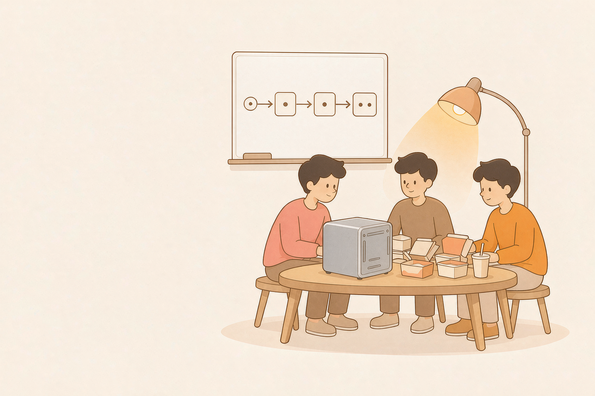
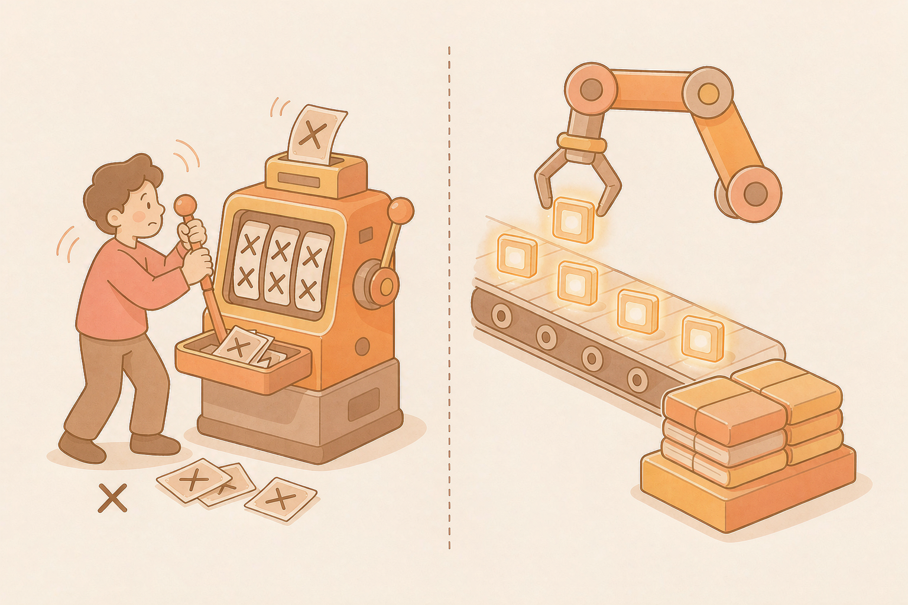
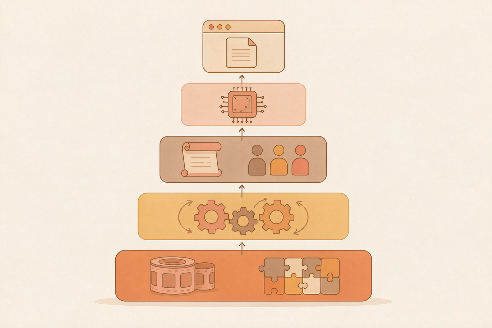
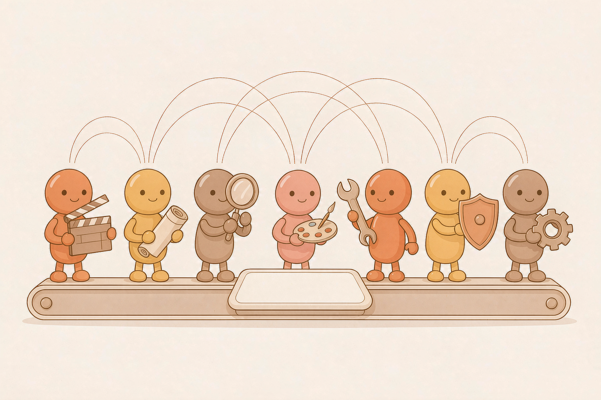

---

*配图：报名那晚，三个人围着一台刚拆箱的 Fusion Xpark GB10，白板上已经开始勾勒生产线。*

## 序：报名那晚，我们立了一个现在想起来手心冒汗的 Flag

DGX Spark Hackathon 报名截止那晚，三个人坐在出租屋地板上啃外卖。Fusion Xpark GB10 是当周才寄到的新机器，连屏幕都还没装上。

"别做 Demo 了，"阿耘嘴里嚼着鸡腿说，"做个**短视频生产工厂 Agent**。"

我（队长）和小北对视了三秒。

"工厂级？"小北问。
"工厂级。"
"三个人？十天？"
"对。"

那个晚上我们立了三个字：**不抽卡**。不是"一句话生成一段视频"，不是"把同一段提示词点 20 次看哪个能交差"。我们要做的是一条**有状态、可审计、可重跑、可修复**的短视频生产线——用户上传素材 → 多智能体协同拆镜 → ComfyUI 渲染 → 审核 Agent 抽帧评分 → 失败自动修复 → 成片自动拼接。

分工也很快定下来：我是队长，把控架构与 Agent 编排；阿耘啃模型优化与决策引擎；小北是工程担当，Web 前端、状态机、SSE 事件流都归他。

谁也没告诉对方，第十天晚上回头看的时候，那条路上**至少有三次**我们以为项目要黄了。

---

## 一、选题：让"AI 视频生成"升级为"AI 视频生产"

### 半小时的冷水

第一天装机、装驱动、起 ComfyUI。MiniMax-H3 第一次吐片那一刻，小群里——队里三个人的小群——一片欢呼："通了通了。"

欢呼只持续了半小时。

阿耘把生成日志往桌上一拍，三个问题像连珠炮：

> "**单次成功有什么用？用户已有素材怎么办？角色跨镜头漂移怎么办？失败了谁知道为什么？**"

小群安静了 10 分钟。

这是我们第一次意识到：**生成式 AI 的敌人从来不是"生成不出来"，而是"生成得不对还说不清哪里不对"。**

### 三条不可违反的纪律

那个晚上我们做了一个反直觉的决定：**先不优化生成，先画生产线。**

视频生成只是流水线一环。围绕它必须铺出五条带：

- **Web 产品层**：工作台不是展示，是控制面；
- **编排与决策层**：FastAPI + SSE + 状态机 + 决策引擎；
- **创作与资产层**：编剧、选角、导演、提示词优化 Agent + 资产库；
- **生成与质检层**：ComfyUI Adapter + 抽帧质检 + 证据链；
- **交付与恢复层**：FFmpeg 合成 + 幂等 command_id + 事件游标。

小北更激进，工作台必须第一个起，**"看都看不见的系统，演示不了，也交付不了。"** 我同意。于是"运行中"被我们拆成"排队 → 加载 → 采样 → 评分 → 等待审核"这些真实阶段。后来证明这个决定救了演示环节的命。

*配图：左边是"抽卡式"生成，右边是"流水线式"生产——我们要的是后者。*

第二天我们开了"纪律大会"。三条不可违反的规矩写在白板上：

1. **所有 LLM 输出必须落到结构化契约**——剧本、角色、场景、道具、分镜、剪辑六层 JSON Schema，由代码钳制。
2. **所有 Agent 必须经状态机**——谁都不许绕过；哪怕是 StepFun 主 Agent，也得按 ShotSpec 写。
3. **所有失败必须带证据**——质检不是打总分，是给证据链；ScoreReport 没有证据等于零分。

这三条纪律，后来写进了 `01-项目说明文档.md`。

---

## 二、编写项目：从一张白板，到一条能跑的产线

### 五层架构不是"想出来"的，是"画出来"的

第三天我们在白板上画了 4 小时架构图。线划了改、改了划、划了擦。

小北擦完最后一版的时候说："今天必须把空壳跑起来，明天再不写代码就黄。"

那天傍晚，FastAPI + 状态机 + SSE 事件流**第一次在浏览器里跳出来**——一行字："Hello stage"。三个人同时笑了。

*配图：五层架构——产品层、编排决策层、创作资产层、生成质检层、交付恢复层。*

### 主角在第三镜换了脸

第四天我们硬着头皮跑了一次端到端"伪成片"：四层架构 + 一组 mock 数据 + 一个真实的 ComfyUI 渲染调用。

渲染是成功的，但接下来发生的事让我们的心沉到了谷底：**主角在第三个镜头里，换了一张脸。**

> "模型不懂"这句话是不存在的。模型只有"模型给的提示不够结构化"。

那一夜我们连夜补招：

- 把主 Agent 设计成**可插拔模型层**，默认 StepFun 阶跃星辰，但允许换成任何 OpenAI-compatible；
- 给角色立**资产登记卡**，description 必须全片逐字一致；
- 给每个镜头加 **reference_assets** 引用，第一个就是定妆照；
- 给 LLM 输出加**结构化契约**，从漂移事件链变成"可定位的契约违例"。

凌晨四点，小北在群里发了一句：

> "**模型负责创作，代码负责纪律。**"

这条后来写进了 `01-项目说明文档.md` 的「作品特点」。

---

## 三、调优 Agent：七角色流水线，与差点散架的那一夜

### 七角色上线，看起来很美

第五天，七个 Agent 同时上线：制片助理、编剧、选角、导演、提示词优化、审核、修复。

我拉起一台隔离环境跑规划链路：制片助理 → 编剧 → 选角 → 导演 → 提示词优化 → 审核 → 修复。

第一次跑完，端到端吐出了一个 30 秒、9:16 的完整短剧——结构整齐、角色稳定、镜头清晰。

*配图：七个 Agent 各司其职，站在同一条流水线上——谁也不许绕过状态机。*

"完美了。

但是"——这是阿耘加的字——"**第三个镜头的次运动没生效，画面像静帧。**"

### 第一次崩盘：审核放行了静帧

接下来 12 小时发生的事，按时间顺序：

- 14:00 — 审核 Agent 抽帧评分，给出 0.92 的"高分"通过；
- 14:15 — 我们看回放，发现第三镜其实**没动**；
- 14:30 — 阿耘说："决策引擎在第二镜后就 keep 0 了，节省算力，但违反了 `secondary_motion` 契约"；
- 14:45 — 小北说："**审核放行了，但事实没通过。质检是失职的。**"
- 15:00 — 三个人第一次在群里摔表情包。

我们意识到两件事：

1. **多 Agent 不是"角色扮演"**——它的价值是"每步可验证、可替换、可审计"。谁跳过状态机，系统就崩。
2. **质检不能只看总分**——必须带证据。

那天夜里我们写下了 `01-项目说明文档.md`「质量与修复闭环」的那段：**审核 Agent 是质检，不是裁判；质检必须有证据。**

---

## 四、大模型调优：530 秒 → 340 秒，凌晨两点我们知道有戏了

### 阿耘的至暗时刻

第六天是阿耘一个人的至暗时刻。

要把 MiniMax-H3 的 ComfyUI 工作流冻结成 API JSON 模板，听起来只是把节点图 export 出来；做起来全是坑：

- 允许替换的输入只有提示词、素材路径、seed、尺寸、时长——多一个字段，模型就失控；少一个，模型出乱码；
- Adapter 要逐场调，每个 Run 必须记录工作流哈希、模型配置、素材版本、输出文件；
- H3 启动参数还得带：`--fp8_e4m3fn-unet --bf16-vae --bf16-text-enc --reserve-vram 2.0`——少一个就 OOM。

阿耘改了十几版 Adapter。凌晨两点，他在群里发："**现在每个成片镜头都能回溯到它是怎么被生出来的。**"

我们回："睡觉吧。"

他没睡。他开始调**决策引擎**。

### 决策引擎从"省钱"到"决策"

凌晨前后——也可以算这一天的尾巴——阿耘把 **009jev Native SLA 路径**接上了：本地 Laya 决策引擎从采样首步开始逐层选 keep rate。

第一次实测数据出来的时候，我们三个人**盯着屏幕沉默了几秒**：

> **5 秒、4 step、热缓存，端到端从 530.2 秒降到 340.1 秒，降幅 35.9%。**

这不是 benchmark 数字。这是每条合格视频的生产成本直接砍掉**三分之一**。

那天早上我们奢侈地吃了一顿豆浆油条。**这是十天里唯一的庆祝。**

*配图：5 秒 4 step 热缓存，530.2 秒 → 340.1 秒，端到端提速 35.9%。*

---

## 五、视频生产与完工：质检证据链、决策可替换、沉淀成 Skill

### 第二次崩盘：审核又放行了角色漂移

这一天下午，我拉起一个生产线程跑 30 秒的 demo 短剧。

前两个镜头完美。第三个镜头——**主角又换了脸**。

但审核 Agent 给的是**总分合格**。

### 推翻质检设计

那一夜我们三个人坐在小屋里，白板上画满了"质检应该是什么"。

小北说："**质检不能只输出总分。**系统必须记录：文件可不可解码、时长对不对、音轨存不存在、抽帧有没有漂移、动作有没有完成、有没有水印、有没有多余人物。**每个 ScoreReport 必须带证据。**"

阿耘补刀："**关键项失败不可被总分抵消。**角色脸对不上，分再高也是废品。"

我加最后一句："**修复不是无限重试。**预算耗尽，自动转人工审核。"

那天夜里没有新功能上线。但我们三个都知道，它从"**能跑**"变成了"**敢交付**"。

*配图：质检不是打总分，而是给证据链——每个 ScoreReport 都必须带证据。*

### 唯一一次吵架：决策层要不要接第二条路径

隔天上午，我们吵了一架——**十天里唯一的一次**。

议题是：要不要花时间接入 OpenJev GGUF 作为第二条决策路径。

- **小北反对**："Laya 已经跑通了。剩两天，稳住交付是正事。绑死一个模型算什么大事？"
- **阿耘坚持**："决策层如果绑死在一个模型上，这个架构就是**半成品**。评审一眼看穿。"
- **我拍板**："接。只给半天。"

结果：OpenJev 用 `llama-server` 跑在宿主机上，客户端严格遵守和 Laya 相同的问题构建与返回契约——**一次通过**。

实测：**400.1 秒，比基线降 24.5%。**

争吵的结论是甜的——决策层被证明可替换，系统不会绑死在单个模型上。小北认输，请了两杯咖啡。

> **这十天里最大的收获是：架构的尊严，不来自能跑，来自能换。**

### 完整流水线跑通

又一天，我们用完整流水线跑了一条 60 秒的成片：5 个场景、12 个镜头、12 个审核 ScoreReport、2 次自动修复、1 次人工审核。

**没崩。**

同日下午，我们用 `#/chat` 跑了第二条：上传一段 docx 字幕 → 自动规划分镜 → 渲染 → 质检 → 拼接。

成片出来的时候，三个人又沉默了几秒——这回是另一种沉默。

> **它真在"生产"了。**

### 最后一天：把"踩过的坑"沉淀成"后来者的路标"

第十天，我们没有加任何新功能。

我们做了一件事：把经验沉淀成两个 Agent Skill。

**Skill 1：`learning-video`** —— 文档图片 → 1080P 学习视频

把前面提过的经验沉淀成 Markdown：docx 提取、`CLIPS` 模板、`gen_learning_video.py`、`concat_learn.sh`、`dewatermark.sh`。

**Skill 2：`short-drama-script`** —— 短剧分镜的结构化提示词规范

把"踩过的坑"写成"路标"：

- 一镜一主动作；
- 角色 description 全片逐字一致；
- 道具登记 count 限定 + start/end_state 互斥；
- 否定约束用英文；
- 渲染只取 `reference_assets` 第一张；
- …共六大层契约、十条写作侧预防对照。

> Skill 的价值在于把"这次调通了"变成"下次可以复用"。
>
> 也把"我们踩过的坑"变成"后来者的路标"。

---

## 尾声：十天之后，我们怎么理解这台机器

### Fusion Xpark GB10 不再是一块"显卡"

十天前，Fusion Xpark GB10 对我们而言是一块"**能跑大模型的本地显卡**"。

十天后，它是一台**本地内容生产的调度中心**：

- StepFun 主 Agent 在上面**思考**；
- MiniMax-H3 在上面**渲染**；
- Laya 和 OpenJev 在上面**决策**；
- 质检和事件流在上面**守住交付底线**。

### 三个人十天的五条经验

如果要总结三个人十天学到的东西，只有五条：

1. **生产线先于生成**——没有状态机和证据链，单次成功毫无意义；
2. **模型负责创作，代码负责纪律**——结构化契约比 prompt 技巧可靠得多；
3. **多 Agent 的价值不是"像团队"，是"可审计"**——可验证、可替换、可修复；
4. **优化要落到端到端成本**——35.9% 不是 benchmark，是每条片子的生产成本直接砍掉三分之一；
5. **最后一天用来沉淀**——Skill 比新 feature 更长寿。

### 这就是短视频工厂 Agent 的十日历程

**三个人的队伍，一台 Fusion Xpark GB10，一条真的能跑的生产线。**

我们没有把"AI 视频生成"做完，我们把"短视频生产"做成了。